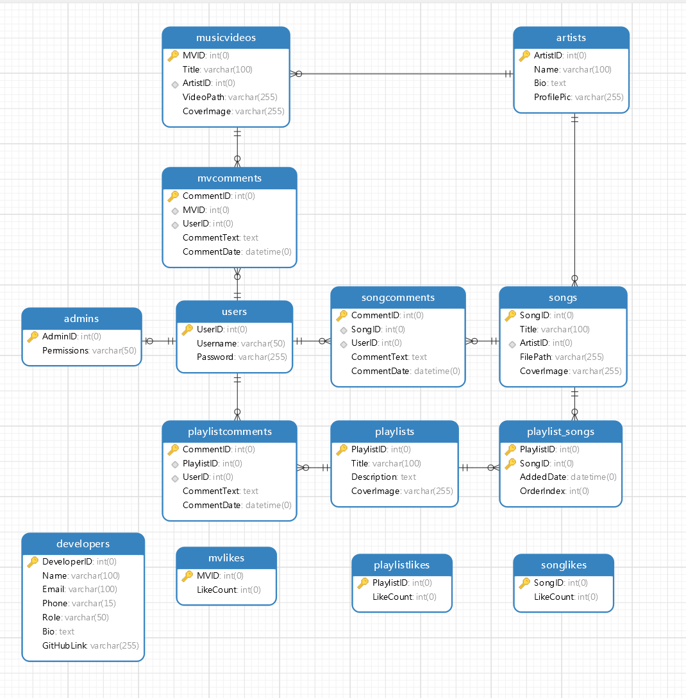
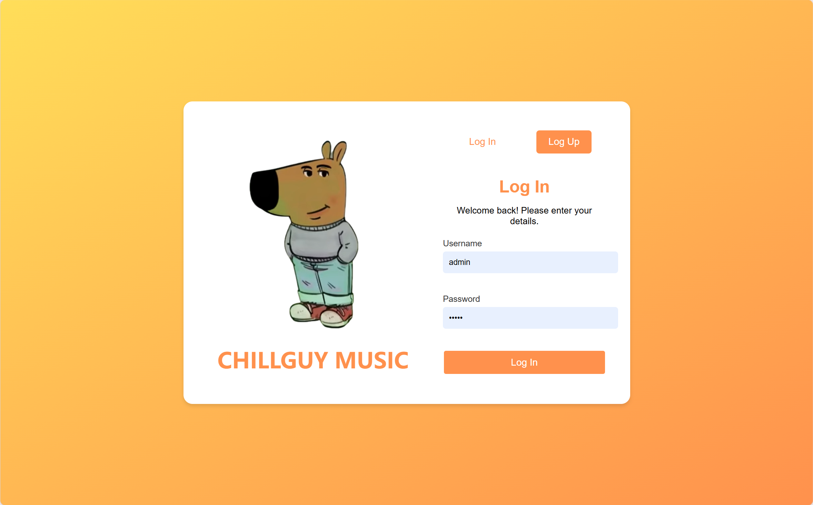
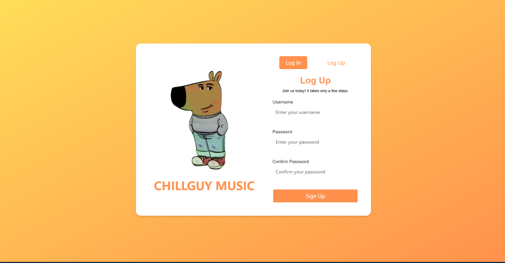
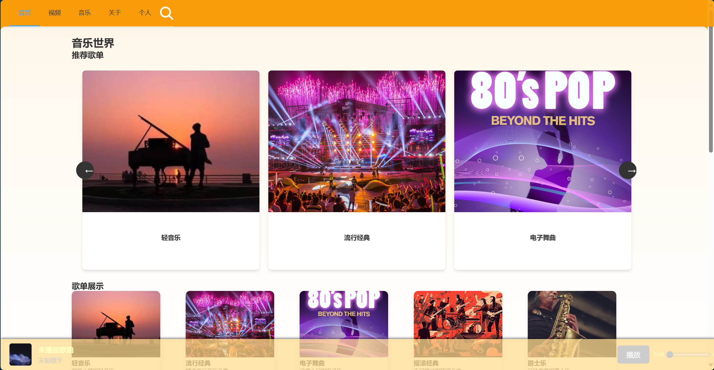
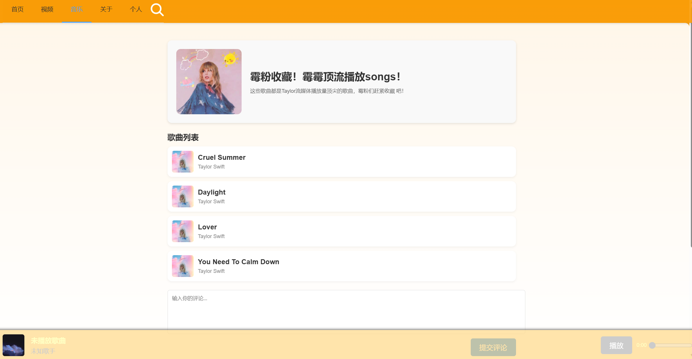
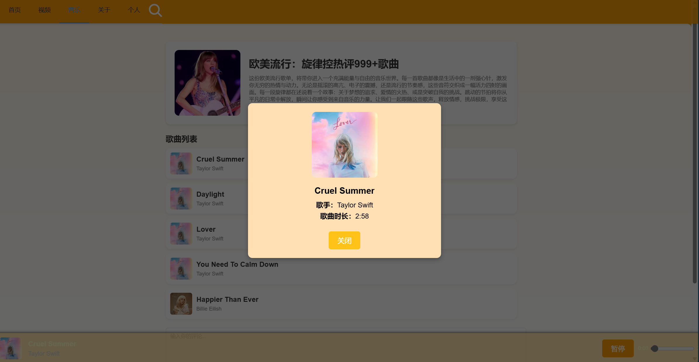
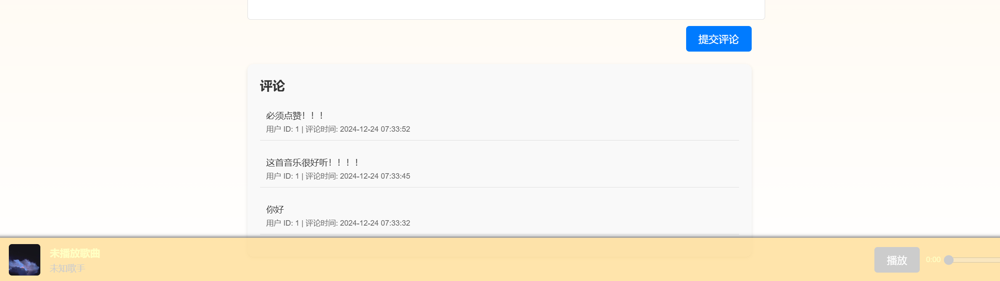
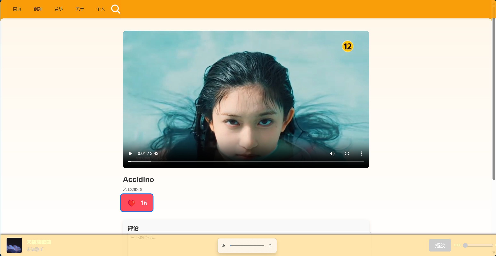
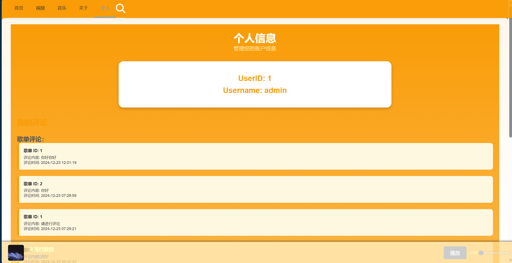

# 数据库设计文档

## 一、项目概述

本项目是一个音乐播放器后端系统，旨在提供音乐视频、歌曲、播放列表管理，以及用户评论、点赞等社交功能。

## 二、数据库设计

本数据库设计支持以下功能：

- 用户注册与登录
- 音乐视频、歌曲和播放列表的管理
- 评论功能
- 点赞统计
- 开发者和管理员权限管理
- 视频的播放与音乐的播放

## 三、数据库结构

### 表结构

#### 1. **musicvideos**

- **MVID**：音乐视频ID（主键）
- **Title**：视频标题
- **ArtistID**：歌手ID（外键，关联`artists`表）
- **VideoPath**：视频文件路径
- **CoverImage**：封面图片路径

#### 2. **mvcomments**

- **CommentID**：评论ID（主键）
- **MVID**：音乐视频ID（外键，关联`musicvideos`表）
- **UserID**：用户ID（外键，关联`users`表）
- **CommentText**：评论内容
- **CommentDate**：评论日期

#### 3. **artists**

- **ArtistID**：歌手ID（主键）
- **Name**：歌手姓名
- **Bio**：歌手简介
- **ProfilePic**：歌手头像路径

#### 4. **users**

- **UserID**：用户ID（主键）
- **Username**：用户名
- **Password**：用户密码

#### 5. **songs**

- **SongID**：歌曲ID（主键）
- **Title**：歌曲标题
- **ArtistID**：歌手ID（外键，关联`artists`表）
- **FilePath**：歌曲文件路径
- **CoverImage**：封面图片路径

#### 6. **songcomments**

- **CommentID**：评论ID（主键）
- **SongID**：歌曲ID（外键，关联`songs`表）
- **UserID**：用户ID（外键，关联`users`表）
- **CommentText**：评论内容
- **CommentDate**：评论日期

#### 7. **playlists**

- **PlaylistID**：播放列表ID（主键）
- **Title**：播放列表标题
- **Description**：播放列表描述
- **CoverImage**：封面图片路径

#### 8. **playlist_songs**

- **PlaylistID**：播放列表ID（外键，关联`playlists`表）
- **SongID**：歌曲ID（外键，关联`songs`表）
- **AddedDate**：添加日期
- **OrderIndex**：播放顺序

#### 9. **playlistcomments**

- **CommentID**：评论ID（主键）
- **PlaylistID**：播放列表ID（外键，关联`playlists`表）
- **UserID**：用户ID（外键，关联`users`表）
- **CommentText**：评论内容
- **CommentDate**：评论日期

#### 10. **playlistlikes**

- **PlaylistID**：播放列表ID（外键，关联`playlists`表）
- **LikeCount**：点赞数

#### 11. **songlikes**

- **SongID**：歌曲ID（外键，关联`songs`表）
- **LikeCount**：点赞数

#### 12. **mvlikes**

- **MVID**：音乐视频ID（外键，关联`musicvideos`表）
- **LikeCount**：点赞数

#### 13. **admins**

- **AdminID**：管理员ID（主键）
- **Permissions**：权限说明

#### 14. **developers**

- **DeveloperID**：开发者ID（主键）
- **Name**：开发者姓名
- **Email**：邮箱
- **Phone**：电话
- **Role**：角色
- **Bio**：简介
- **GitHubLink**：GitHub链接

## 四、数据关系说明

1. 每个**音乐视频**（`musicvideos`）由特定的歌手（`artists`）创建。
2. 用户（`users`）可以对**音乐视频**（`mvcomments`）、**歌曲**（`songcomments`）以及**播放列表**（`playlistcomments`）进行评论。
3. **播放列表**（`playlists`）由多个**歌曲**（`playlist_songs`）组成，并可设置播放顺序。
4. 用户对**歌曲**（`songlikes`）、**播放列表**（`playlistlikes`）及**音乐视频**（`mvlikes`）进行点赞。

## 五、系统功能模块

1. **用户管理**：支持用户注册、登录和密码管理。
2. **内容管理**：支持音乐视频、歌曲和播放列表的增删改查功能。
3. **社交互动**：支持用户评论和点赞功能。
4. **开发者与管理员管理**：提供开发者资料记录及管理员权限分配功能。

## 六、系统执行流程

### 1. 进入网站

用户访问网站主页，系统判断用户的登录状态。

- **是否已登录**：
  - **已登录**：直接进入网站主页面。
  - **未登录**：跳转到登录页面。

---

### 2. 登录页面

用户在登录页面可以选择进行登录或注册。

#### 2.1 用户是否已有账号？

- **是（已有账号）**：
  - 用户输入账号和密码尝试登录。
  - 系统验证用户信息，判断登录是否成功。
- **否（未注册）**：
  - 用户选择进行注册。

---

### 3. 注册流程

用户进入注册页面，完成以下步骤：

1. 输入必要的注册信息（如用户名、密码、邮箱等）。
2. 提交注册信息，系统进行校验（如用户名是否重复）。
3. 系统返回注册结果：
   - **注册成功**：跳转到登录页面，让用户登录。
   - **注册失败**：提示用户失败原因（如信息不完整或用户名已存在），允许用户重新注册。

---

### 4. 登录流程

用户尝试登录后，系统进行以下处理：

1. 检查用户名和密码是否匹配。
2. 返回登录结果：
   - **登录成功**：判断用户角色。
     - **管理员**：进入管理后台。
     - **普通用户**：进入网站主页面。
   - **登录失败**：提示用户失败原因（如用户名不存在或密码错误），返回登录页面重新尝试。

---

### 5. 管理后台操作（仅管理员）

如果登录用户是管理员，则进入管理后台，允许执行以下操作：

1. 内容管理：上传、编辑或删除音乐视频、歌曲、播放列表等。
2. 用户管理：查看用户列表、管理用户权限。
3. 系统设置：调整系统配置。

---

### 6. 网站主页面操作（普通用户）

如果登录用户是普通用户，则进入网站主页面，允许执行以下操作：

1. 浏览音乐视频、歌曲和播放列表。
2. 对内容进行评论和点赞。
3. 创建、编辑和管理个人的播放列表。

---

### 7. 退出或超时

- **用户主动退出**：用户点击“退出”按钮，系统清除用户会话并返回登录页面。
- **登录超时**：系统检测用户登录会话超时后，强制退出并跳转到登录页面。

---

### 流程整体逻辑

通过这个流程，系统可以实现：

- 用户注册和登录功能。
- 区分管理员和普通用户的权限。
- 支持基础的用户内容交互（评论、点赞等）。
- 提供管理后台供管理员管理网站内容和用户。

## 七、网页设计

### 1.登录页面

### 2.注册页面

### 3.主页

### 4.歌单页面

### 5.MV页面

### 6.团队主页

### 7.个人信息页面

### 8.搜索页面

## 附注

本设计充分考虑了扩展性和功能模块的独立性，确保后续功能拓展的便捷性。
